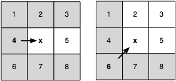
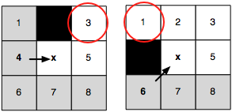

# IMPLEMENTATION DOCUMENT

This document details the implementation of all used algorithms and data structures. It will also try to explain the reasons why the software is structured the way it is. Design choices for the user interface and other general web application logic are not provided.

Other interesting documents include [Usage of AI Report](https://github.com/joonarafael/visualpathfinder/tree/main/documentation/usage_of_ai_report.md "Usage of AI Report") and [Software Testing Report](https://github.com/joonarafael/visualpathfinder/tree/main/documentation/software_testing_report.md "Software Testing Report").

## About Benchmarking and Other Performance Stuff

The application is built in TypeScript and runs on a Node.js server. The built-in timer to measure algorithm runtime is accurate to a certain point, but read the numbers with a good amount of criticism. Decision of browser, as well as the general differences between machines and server environments, greatly affect the performance. Resulting performance numbers even within the **same environment**, **same map** and **same algorithm** can differ over 50% at times.

However, the accuracy of the algorithms is still very relevant and the resulting path lengths (both in node count and Euclidean distance) should be examined closely. All pathfinders are designed to find **_some shortest path_** (maybe different but equally long) and if given results differ, the search for issues and inconsistencies within the code needs to start.

## Design Choices

### Helper Functions and Classes

#### Euclidean Distance Function

See the source code [here](https://github.com/joonarafael/visualpathfinder/tree/main/app/application/algorithms/euclidean.ts "Redirect to file 'euclidean.ts'").

The Euclidean distance function calculates the absolute distance between two given points on the map. It also enables diagonal distance calculation where two immediately adjacent diagonal points have an absolute distance of $\sqrt{2}$.

#### Function for Adjacency List Generation

See the source code [here](https://github.com/joonarafael/visualpathfinder/tree/main/app/application/algorithms/generateadjacencylist.ts "Redirect to file 'generateadjacencylist.ts'").

This is a helper function to generate a one-dimensional adjacency list of the current grid status. It completely scans through the current grid and adds every single node and their respective neighbors as a 'key, values' pair into the record. It deals with general wall detection, horizontal obstacle detection and borders. This way the pathfinders do not need their own obstacle detection logic, reading the given adjacency list is enough.

#### Diagonal Checking

See the source code [here](https://github.com/joonarafael/visualpathfinder/tree/main/app/application/algorithms/isdiagonal.ts "Redirect to file 'isdiagonal.ts'").

This is a helper function to check whether or not two given points are located on the same diagonal line. The given points do not need to be immediately adjacent (e.g. their respective absolute distance may be greater than $\sqrt{2}$).

#### Priority Queue Class

See the source code [here](https://github.com/joonarafael/visualpathfinder/tree/main/app/application/algorithms/pq.ts "Redirect to file 'pq.ts'").

This is an important class for all pathfinding algorithms. It is a specific class object to store individual nodes and their respective priorities in a binary heap data structure.

Special thanks for the suggestion by [psangi-hy](https://github.com/psangi-hy "psangi-hy on GitHub") to change to a heap structure (course peer review issue).

### Pathfinding Algorithms

Every included algorithm utilizes the one-dimensional adjacency list to perform the pathfinding. JPS also requests the current field status to check if scanning reaches the edge of the map. Other two algorithms perform the pathfinding solely on the given adjacency list.

#### Dijkstra

See the source code [here](https://github.com/joonarafael/visualpathfinder/tree/main/app/application/algorithms/dijkstra.ts "Redirect to file 'dijkstra.ts'").

Dijkstra algorithm always expands parent node in all directions and calculates the best known distance **from start** to all new neighbors. These nodes are kept in a priority queue based on the distance calculation and new neighbors are processed depending the order of the queue.

#### A\*

See the source code [here](https://github.com/joonarafael/visualpathfinder/tree/main/app/application/algorithms/astar.ts "Redirect to file 'astar.ts'").

A\* is the _optimized Dijkstra_. It performs slightly better due to the fact that **it knows the location of the end node**. Therefore it always prioritizes nodes closer to the end node. It will process lesser nodes only after reaching a dead end.

A\* still has to process every immediately adjacent node. The amount of nodes, however, is reduced from Dijkstra so much that it should always be faster. Sometimes, if the amount of processed nodes can't be cut down, both A\* and Dijkstra will perform just about the same.

#### Jump Point Search

See the source code [here](https://github.com/joonarafael/visualpathfinder/tree/main/app/application/algorithms/jps.ts "Redirect to file 'jps.ts'").

JPS, for it's own part, is _a specially optimized version of A\*_. It is, too, blessed with the knowledge of the end node location and therefore utilizes the same kind of heuristic node prioritizing as the base A\*.

The JPS algorithm takes advantage of the known fact that **tile maps** (e.g. undirected & unweighted uniform grids) have some special attributes in their symmetry. More details about the grid scanning and neighbor pruning can be found below.

As a default, **only the starting node is expanded in every 8 direction**. Expanding a "parent node" (in the relevant directions) means scanning the next nodes in the same line as long as a stopping condition is met. In such an event, the found node is considered as a _jump point_ for the parent node. The pathfinding continues by expanding this newly found jump point.

While the required amount of processing for a single node is greater than in the base A\*, the sheer quantity of visited nodes reduces so much that the algorithm becomes more efficient (on a favorable map). Paths with a lot of turns, diagonal objects or other zigzagging hinder the performance of the JPS algorithm, sometimes rendering it slower than the A\*.

Good examples of potential JPS performance in this application are, for example, the maps called _Baldur's Gate 1_ and _Benchmark 1_. On the other hand, JPS performs poorly on nearly all included city maps as the algorithm is never able to jump more than ~2 steps at a time! Great testimonies of JPS performance are also the included _virtual maps_. JPS will almost always be the fastest candidate in maps that large (assuming long straight/diagonal lines).

**Interesting JPS rules**

**_Neighbor Pruning_**

During the scanning of a suitable jump point for the parent node, all tiles greyed out can be discarded. We can do this safely based on the known fact of **tile maps**: no better path to the future target can be found that runs through those grey tiles.

This makes the straight direction jump really straightforward. Diagonal jumps, on the other hand, require quick scans in two cardinal directions (north & east in the picture above) before advancing further. If the "_cardinal directions scan_" returns something (possible jump point(s)), the diagonal jump is terminated and the `x` tile as marked as a jump point for the original parent node.

**_Forced Neighbors and Jump Point Creation Logic_**

The neighbor pruning process finishes once a forced neighbor is found. This makes the `x` tile the natural neighbor (and a jump point) for the original parent node. The relevant directions, as to where the grid scanning should continue from the newly created jump point `x`, are stored in to a separate data structure. As an example, in the left picture above, requested directions for `x` (as where to expand it in the future) are only northeast and east (towards tiles `3` and `5`).

Note that running directly into a wall **does not** create a jump point. Other previous diagonal steps (and their respective cardinal direction scans) have taken care of the immediately adjacent nodes to this 'into-a-wall-running' tile.
